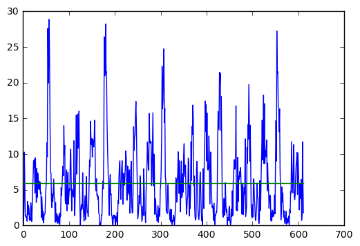
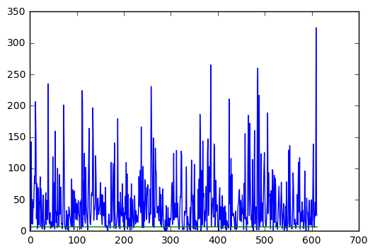
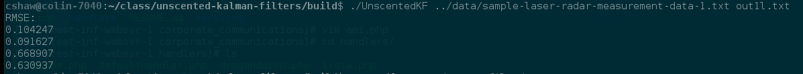
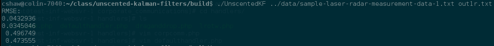
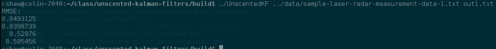
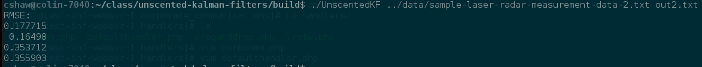

# Unscented Kalman Filter 

This is code for a project for Udacity's Self-Driving Car NanoDegree having to do with Unscented Kalman Filters.
The code is based on the [starter project](https://github.com/udacity/CarND-Unscented-Kalman-Filter-Project).


### Code Structure

While there are plenty of ways that various aspects of the code could be partitioned, it was simplest to 
just keep it in one class.  That way the ability to compute on object variables made much of the 
orchestration of the routines very simple.  Clearly the code could be reorganized in myriad ways to 
abstract some of the various parts.  For example , I could have put RMSE and NIS in a separate file, and 
could have encapsulate the differences in the lidar and radar methods in subclasses, etc., but for the 
purposes here it was more direct to not take this approach.  It probably would have been handy to have 
used something like `map` on some of the iterations, as this could relieve human error, but I chose not 
to because that would make it incomparable to the example code that was handy for debugging.


### How To Build

Nothing new about building it.  For example:

```
cd build
cmake ..
make
UnscentedKF ../data/sample-laser-radar-measurement-data-1.txt out1.txt
```

You will note that there are several output files present for your convenience in the `output_files` directory:

 * out1l.txt — lidar only for data set 1
 * out1r.txt — radar only for data set 1
 * out1.txt — combined lidar and radar for data set 1
 * out2.txt — combined lidar and radar for data set 2

Note: The output format is changed from the original repository.  I am generating the estimated positions 
and velocities in Cartesian coordinates, as well as the ground truth values in the same coordinates, followed
by the NIS value.  The original output format also had the complete UKF state and the input measurement 
values.  The output I am generating is more useful for indicating the fitness of the model, generating 
residuals and plotting the NIS.  
 


### A Note About Standard Deviations

You will find a Jupyter Notebook called [InputFileStatistics](jupyter/InputFileStatistics.ipynb) that computes the
standard deviation of the residuals of the ground truth and "measured" data from the two input files.  These 
values are made comparable by very loose rounding and estimating the average.  Process covariance figures
can, to a certain degree, be estimated by looking at the standard deviation of the change in velocity and
the change in yaw.  Since the "measured" data does not directly include this for the lidar data, and since
in observing the residuals and noting that there is fairly good correlations between the radar and lidar
data, I estimated this entirely based on the radar data since it is more convenient.  I found that it is not
quite ad directly useful in the same way that the standard deviation of the residuals is, but it is a 
reasonable starting point for finding good values.


### Consistency Verification

Consistency was verified by observing the Normalized Innovation Squared (NIS) of the estimates.  This is 
the square of the residual, which is a Chi-squared distribution.  The number of degrees of freedom is the rank 
of the measurement covariance matrix, which is two in the case of lidar and three in the case of radar.  When
these are plotted, it is against a value looked up in a Chi-squared table for a given confidence and the 
specified degrees of freedom.  I chose the 95% confidence, which makes this figure 5.991 for the lidar and
7.815 for the radar.  The following two plots are generated from the Jupyter notebook [PlotNis](jupyer/PlotNIS.ipynb).

You will notice that these graphs have several problems.  First, they are no where near the expected result
in terms of number of values exceeding the Chi-squared values for the respective sample type.  This is actually
not a wholly bad thing in this case.  The measurement standard deviations are selected to be very small, which
renders good tracking and a low RMSE.  It appears that the NIS depicts a residual that is questionalby normally 
distributed, which is consistent with something tracking the data very closely.  This makes the utility of the 
NIS as a measurement less valuable.  I have not found a combination of parameters that simultaneously keeps 
the RMSE in bounds for both data sets and produces a NIS that is expected.  However, it is easy to produce such
an NIS if the elements of the covariance matrices are larger (e.g. the standard deviations specified are larger).

Lidar NIS:




Radar NIS:



As you can see, awful!  But in this case the RMSE is the more desired metric for performance and the hypothesis 
of normality of the residuals is a bit questionable.


### Numeric Results

Another measure of the results is the root mean squared error (RMSE).  Here is what this code generates 
for the RMSE for the two supplied data sets, including the first data set split into a lidar and radar 
only case:


Data Set 1 — Lidar only:



Data Set 1 — Radar only:



Data Set 1 — Lidar and Radar:



You will notice that the combined RMSE is not better than both the lidar or radar separately.  It is 
not all that tough to make it so that this works as expected in this case, with the combined data set
having better results than the two components, but it is more difficult to have this occur when it 
must also meet the requirement that the second data set meets the criteria, as the values shift.  As you
can see, the combined set does generally have improvement, as the lidar only case does not meet the 
requirement using the parameters that mutually satisfy the two data sets combined.

Data Set 2 — Lidar and Radar:



